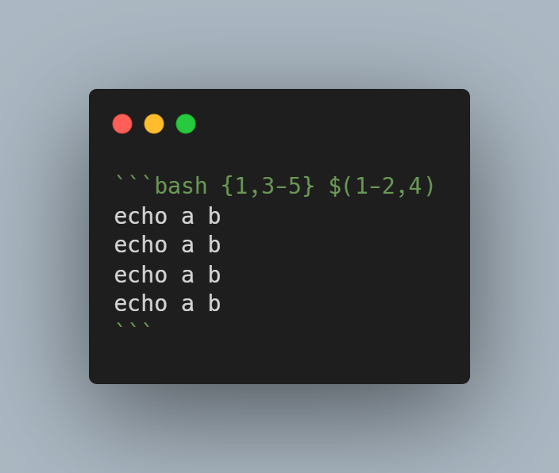
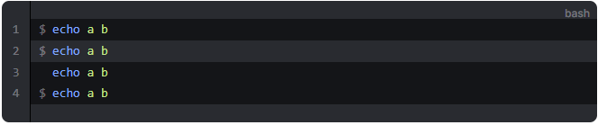

# itcatplayit/vitepress-markdown-it-repl

[](https://www.npmjs.com/package/vitepress-markdown-it-repl)
[](https://github.com/itcatplayit/vitepress-markdown-it-repl/blob/main/LICENSE)

repl display for [markdown-it](https://github.com/itcatplayit/vitepress-markdown-it-repl) plugin in vitepress project.

## Install

```sh
npm i vitepress-markdown-it-repl
```

## Usage

in your vitepress project's `.vitepress/config.ts` file:

```ts
import { defineConfig } from 'vitepress'
import { default as replPlugin } from 'vitepress-markdown-it-repl';

export default defineConfig({
  // ...
  markdown: {
    lineNumbers: true, // or false
    // set globalEnabledLineNumbers's value same as lineNumbers above.
    config: md => replPlugin(md, { globalEnabledLineNumbers: true })
  },
  // ...
})
```

then, in your markdown file, you can use as this:



it will display repl symbol:


